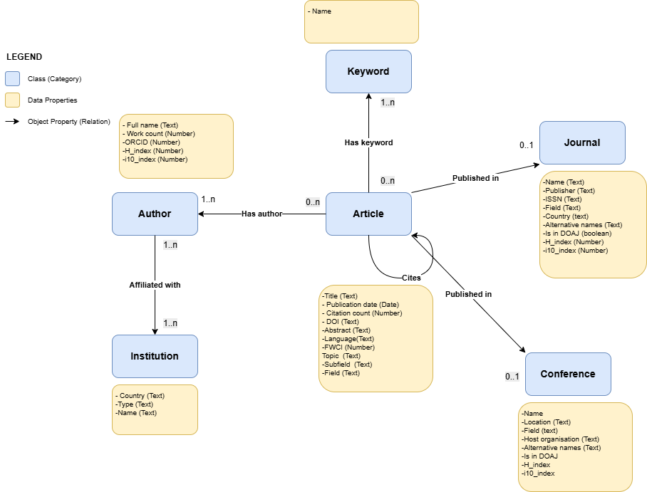

# Semantic Wiki RAG

A pipeline that extracts scholarly metadata from **OpenAlex API** and populates a **Semantic MediaWiki** with structured knowledge about research articles.
(RAG to add soon)

## Ontology

<p align="center">
  
</p>

## 📁 Project Structure
```
Semantic_Wiki_RAG/
├── Extraction.py                  # Data extraction & mapping from OpenAlex
├── FillingPipeline.py             # Automated MediaWiki page creation
├── UndoInvertIndex.py             # Abstract reconstruction utility
├── requirements.txt               # Dependencies
├── Ontology/
│   └── oontology_schema.drawio.png # Ontology visualization
    └── OntologyOnProtege_.rdf
├── MappedDataExamples/            # Sample mapped data
│   ├── Article
│   ├── ListOfAuthors
│   └── SourceJournalConference
└── OpenAlex_ResponsesExamples/    # Raw API responses
    ├── Author_OriginalResponse
    ├── DOI_OriginalResponse
    └── Source_OriginalResponse
```

## Setup

1. **Clone & install**
```bash
   git clone https://github.com/Imane-krb/Semantic_Wiki_RAG.git
   cd Semantic_Wiki_RAG
   pip install -r requirements.txt
```

2. **Configure `.env`**
```env
   Wiki_username=your_username
   Wiki_password=your_password
   Wiki_urlBase=https://your-wiki/api.php
   Authorisation=your_email
```

##  Usage
```python
from FillingPipeline import Filling_Pipeline

# Single article
Filling_Pipeline("https://doi.org/10.1109/ACCESS.2024.3498107")

# Multiple articles
DOI_list = [
    "https://doi.org/10.1109/ACCESS.2024.3498107",
    "https://doi.org/10.1016/J.APENERGY.2021.116601"
]
for DOI in DOI_list:
    Filling_Pipeline(DOI)
```

##  Pipeline Flow
```
OpenAlex API → Extraction.py → FillingPipeline.py → Semantic MediaWiki
                    │
            Maps to ontology:
            - Article
            - Author  
            - Journal/Conference
            - Institution
            - Keyword
```

## Data Examples

| Folder | Content |
|--------|---------|
| `OpenAlex_ResponsesExamples/` | Raw JSON responses from OpenAlex API |
| `MappedDataExamples/` | Transformed data matching our ontology |

